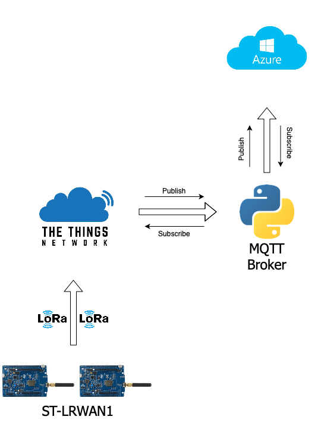

# Send telemetry data through LoRa using St-Lrwan1 devices and the things network

This is the folder for the third assignment of the iot class. The goal of this assignment was to build on-top of the cloud-based and edge-based components developed in the first and second assignments a system that retrieves telemery data from sensors. Now I have replaced the MQTT protocol and the short-range wireless medium with LoRaWAN and TheThingsNetwork. In this assignment I developed a new RIOT-OS application that will be executed on the B-L072Z-LRWAN1 LoRa kit. We will use TheThingsNetwork to interconnect the sensor devices with the cloud infrastructure via the MQTT protocol. Below you will find an hands-on tutorial, that shows how to build a system like this on top of Azure IoT hub and TheThingsNetwork, and a short youtube video that shows in practice the functioning of this system.

Here you can find the hands on guide that will help you to develop a system like this: [Hands-on guide](https://www.linkedin.com/pulse/hands-on-tutorial-3-how-retrieve-telemetry-data-from-sensors-nicoló/?published=t)

Here you can find the video that shows the functioning of this system: [Youtube video](https://youtu.be/qMlvtD95DGE)
