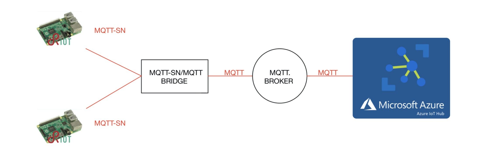

# How to send telemetry data from sensors using RIOT os

This folder contains code that could be used to build a system that retrieves telemetry data from sensors and sends it though an architecture like: RIOT device -> MQTT-SN/MQTT bridge -> MQTT broker -> Azure IoT Hub -> Web App. This aims to extend the work done in the first guide with the possibility to develop some code that can actually run on real devices, that do not need anymore to be simulated by a python script. Below you will find an hands-on tutorial, that shows how to build a system like this on top of Azure IoT hub, and a short youtube video that shows in practice the functioning of this system.

Here you can find the hands on guide that will help you to develop a system like this: [Hands-on guide](https://www.linkedin.com/pulse/how-retrieve-telemetry-data-send-web-app-through-mqtt-nicoló-palmiero/?published=t
)

Here you can find the video that shows the functioning of this system: [Youtube video](https://youtu.be/K2o-JvymCBA)
