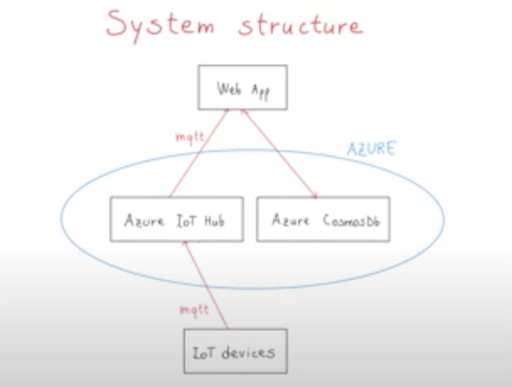

# Visualization of telemetry data sent by two simulated devices through the MQTT protocol

This repo contains code for a python script simulating devices that send telemetry data to an Azure IoT hub using the MQTT protocol.

The architecture of this system is composed by the python script that simulates the two devices, Azure Iot Hub, the web app that acts as a public dashboard to see the traffic of data, and cosmosDb to implement the persistence layer. Below you will find an hands-on tutorial, that shows how to build a system like this on top of Azure IoT hub, and a short youtube video that shows in practice the functioning of this system.

Here you can find the hands on guide that will help you to develop a system like this: [Hands-on guide](https://www.linkedin.com/pulse/hands-tutorial-visualize-telemetry-data-from-iot-devices-palmiero/)

Here you can find the video that shows the functioning of this system: [Youtube video](https://www.youtube.com/watch?v=ZzF0ofugn1I)
