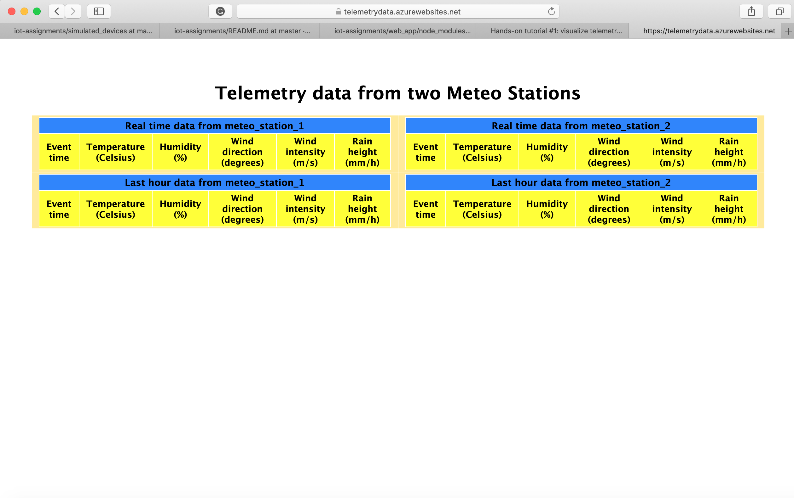

# Web application

To initialize the web application on your local environment you have to copy the content of this folder in a folder on your machine. After that, make sure that you have npm installed, you can check it by typing *npm --version* on your command line. Now cd into your local web app and type the following command: *npm init -y* this will install all the necessary dependencies to run the web application on your local environment. To see how to connect it to Azure IoT hub follow the steps reported on the iot-first-assignment hands-on guide: [Here](https://www.linkedin.com/pulse/hands-tutorial-visualize-telemetry-data-from-iot-devices-palmiero/)
